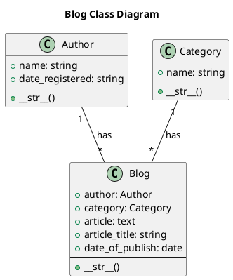

# class diagram
This  is a UML class diagram for the system.

```plantuml
@startuml
title Blog Class Diagram

class Author {  
  + name: string
  + date_registered: string
  --
  + __str__()
}

class Blog {  
  + author: Author 
  + category: Category
  + article: text
  + article_title: string
  + date_of_publish: date
  --
  + __str__()
}

class Category {  
  + name: string
  --
  + __str__()
}

Author "1" -- "*" Blog : has
Category "1" -- "*" Blog : has 

@enduml
```