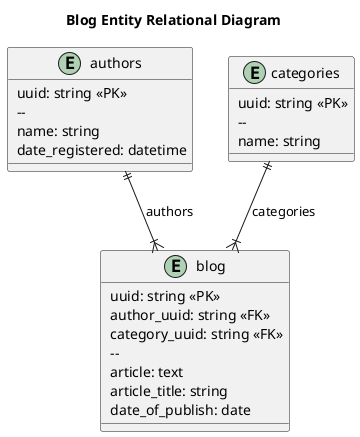

# entity relational diagram (erd)
This is a UML erd diagram of the database schama.

```plantuml
@startuml
title Blog Entity Relational Diagram

entity "authors" as authors {
 uuid: string <<PK>>
 --
 name: string
 date_registered: datetime  
}

entity "blog" as blog {
 uuid: string <<PK>>
 author_uuid: string <<FK>>  
 category_uuid: string <<FK>> 
 --
 article: text 
 article_title: string
 date_of_publish: date 
}

entity "categories" as categories {
 uuid: string <<PK>>
 --
 name: string
}

authors ||--|{ blog: authors
categories ||--|{ blog: categories 
@enduml
```